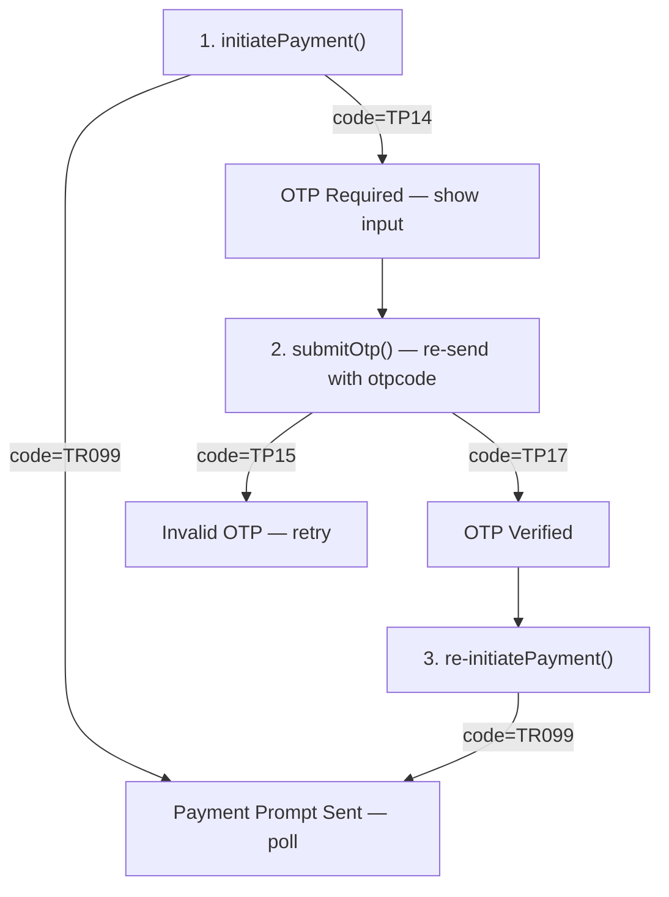

# Moolre OTP Verification Flow

Handle the conditional OTP step that Moolre may require before a mobile money payment prompt is sent to the customer.

## Background

Currently, `processMobileMoney` calls `MoolrePaymentService::initiatePayment()` and assumes a successful response means the payment prompt was sent directly to the customer's phone. However, Moolre may respond with code **`TP14`** instead, meaning an OTP has been sent via SMS to the customer and must be verified before the payment prompt can be triggered.

### Moolre API Flow (3 steps when OTP is required)



| Response Code | Meaning | Action |
|---|---|---|
| `TP14` | OTP sent to customer | Show OTP input field |
| `TP17` | OTP verified | Re-initiate the original payment request |
| `TR099` | Payment prompt sent | Enter polling/awaiting state |
| `TP15` | Invalid OTP | Show error, let user re-enter |
| `TP13` | Non-unique `externalref` | Generate new reference, retry |

## User Review Required

> [!IMPORTANT]
> **OTP Removability**: Per Moolre docs, the OTP step can be removed for qualifying merchants. The implementation uses a simple response-code check (`TP14`) so if OTP is never returned, the flow skips it automatically. No feature flag needed — the API response itself is the gate.

> [!IMPORTANT]
> **No new database columns needed.** The OTP state is entirely ephemeral (lives in the Livewire component session). We don't persist OTP codes or OTP state to the database.

## Proposed Changes

### MoolrePaymentService

#### [MODIFY] [MoolrePaymentService.php](file:///home/oheneadj/server/dpc/app/Services/MoolrePaymentService.php)

Add a `submitOtp()` method that re-submits the payment request with the customer's OTP code:

- **`submitOtp(Booking $booking, string $channel, string $payerNumber, string $otpCode): array`**
  - Same payload as `initiatePayment()` but with `otpcode` populated
  - Returns the Moolre API response (expecting `TP17` on success, `TP15` on invalid)
- The existing `initiatePayment()` already sends `'otpcode' => ''` — no change needed there.
- After OTP is verified (`TP17`), the Livewire component will call `initiatePayment()` again to trigger the actual payment prompt.

---

### CheckoutPayment Livewire Component

#### [MODIFY] [CheckoutPayment.php](file:///home/oheneadj/server/dpc/app/Livewire/Booking/CheckoutPayment.php)

Introduce a **state machine** with three UI states instead of the current binary (`isAwaitingPayment` true/false):

**New properties:**
```php
public string $paymentStep = 'form';  // 'form' | 'otp' | 'awaiting'
public string $otpCode = '';
public ?string $otpMessage = null;    // Message from Moolre to display
```

**Remove:** `$isAwaitingPayment` (replaced by `$paymentStep`)

**Modified `processMobileMoney()` logic:**
```
1. Validate & call initiatePayment()
2. Check response code:
   - TP14 → set paymentStep = 'otp', store otpMessage
   - TR099 → set paymentStep = 'awaiting' (normal flow, OTP skipped)
   - else → show error
```

**New `submitOtp()` action:**
```
1. Validate otpCode (required, 4-6 digits)
2. Call MoolrePaymentService::submitOtp()
3. Check response code:
   - TP17 → OTP verified, call initiatePayment() again
     - TR099 from re-initiate → set paymentStep = 'awaiting'
   - TP15 → Invalid OTP, show error, stay on OTP step
   - else → show error
```

**New `resendOtp()` action:**
```
1. Call initiatePayment() again (with empty otpcode)
2. TP14 → show "new OTP sent" message
```

**Updated `retry()` / `cancelPayment()`:**
- Reset `paymentStep` back to `'form'` and clear `otpCode`

**Updated `mount()`:**
- Auto-resume: if booking has `payment_reference` and status is Pending → `paymentStep = 'awaiting'`

**Backward compatibility for `isAwaitingPayment`:**
- Replace all references with `$paymentStep === 'awaiting'`

---

### Checkout Payment Blade View

#### [MODIFY] [checkout-payment.blade.php](file:///home/oheneadj/server/dpc/resources/views/livewire/booking/checkout-payment.blade.php)

Replace the binary `@if ($isAwaitingPayment)` with a three-state conditional:

**`@if ($paymentStep === 'awaiting')`** — Existing "Awaiting Authorization" UI (unchanged)

**`@elseif ($paymentStep === 'otp')`** — New OTP entry screen:
- Title: "Verification Required"
- Message from Moolre API (e.g., "Please complete the verification process sent to you via SMS")
- Single OTP input field (4-6 digit code) using `x-app.input`
- "Verify & Pay" button → calls `submitOtp`
- "Resend Code" link → calls `resendOtp`
- "Cancel" link → calls `cancelPayment`
- Same card styling as the awaiting state for visual consistency

**`@else`** — Existing payment form (network selection + phone number) — unchanged

---

### Tests

#### [MODIFY] [CheckoutPaymentTest.php](file:///home/oheneadj/server/dpc/tests/Feature/Livewire/CheckoutPaymentTest.php)

Add new test cases:

1. **`it enters OTP state when Moolre returns TP14`** — Mock returns `TP14`, assert `paymentStep === 'otp'`
2. **`it submits OTP and enters awaiting state on TP17 then TR099`** — Mock `submitOtp` returns `TP17`, then `initiatePayment` returns `TR099`, assert `paymentStep === 'awaiting'`
3. **`it shows error for invalid OTP code TP15`** — Mock returns `TP15`, assert error message shown and still on `'otp'` step
4. **`it skips OTP when Moolre returns TR099 directly`** — Existing test updated to assert `paymentStep === 'awaiting'` instead of `isAwaitingPayment`
5. **`it can resend OTP`** — Calls `resendOtp`, mock returns `TP14`, assert still on `'otp'` step with success message

Update existing test that checks `isAwaitingPayment` → check `paymentStep` instead.

## Open Questions

> [!IMPORTANT]
> **OTP Length**: The Moolre docs don't specify OTP length. I'll default to accepting 4-6 digits. Do you know the actual length?

> [!NOTE]
> **Non-unique `externalref` (TP13)**: If the user retries after OTP and hits `TP13`, we'd need to generate a new booking reference. Currently the reference is set at booking creation time. Should we handle this edge case now, or defer it?

## Verification Plan

### Automated Tests
```bash
php artisan test --compact --filter=CheckoutPayment
```

### Manual Verification
- Test with a real Moolre sandbox number that triggers OTP (`TP14`)
- Test with a number that skips OTP (goes straight to `TR099`)
- Verify OTP input UI renders correctly and the submit/resend/cancel buttons work
- Verify invalid OTP (`TP15`) shows error and allows retry
